# 胸片二分类实验分析报告（详细版）

> 注：本报告自动从实验结果 JSON 中读取指标并生成图表。

## 1. 数据集与划分
### 1.1 数据集来源
- Kaggle: paultimothymooney/chest-xray-pneumonia
- 本地路径: data/chest_xray/

### 1.2 数据划分统计（split 文件）
- train: total=4694 | NORMAL=1207 | PNEUMONIA=3487
- val: total=522 | NORMAL=134 | PNEUMONIA=388
- test: total=624 | NORMAL=234 | PNEUMONIA=390

### 1.3 划分策略
- train/val 从原始 train 分层抽样（val_fraction=0.1, seed=42）
- test 直接使用原始 Kaggle test

## 2. 预处理与增强
### 2.1 统一预处理
- 图像转 RGB
- 统一 resize 到 448x448

### 2.2 CNN 数据增强
- RandomHorizontalFlip
- RandomRotation(5°)
- ImageNet normalize

### 2.3 VLM embeddings pooling 消融
- all_tokens: mean pooling 全部 token
- vision_only: 仅对视觉 token pooling

## 3. 实验设置概览
- Zero-shot (Qwen2-VL): log-likelihood 评分
- Probe (linear/mlp): 冻结 VLM 表征 + 分类头
- CNN baseline: ResNet18 全量微调
- Data efficiency: MLP 在不同训练比例下的性能

## 4. 核心结果表
### 4.1 Baseline (test)
| Model | Accuracy | AUROC | AUPRC | Recall | Specificity |
|---|---:|---:|---:|---:|---:|
| zero_shot | 0.1506 | 0.0893 | 0.4301 | 0.1538 | 0.1453 |
| probe_linear (vision_only) | 0.7324 | 0.9338 | 0.9588 | 0.9846 | 0.3120 |
| probe_mlp (vision_only) | 0.7468 | 0.9315 | 0.9551 | 0.9872 | 0.3462 |
| cnn_resnet18 | 0.8189 | 0.9658 | 0.9705 | 0.9974 | 0.5214 |

### 4.2 Pooling 消融 (test)
| Model | Pooling | Accuracy | AUROC | AUPRC | Recall | Specificity |
|---|---|---:|---:|---:|---:|---:|
| probe_linear | all_tokens | 0.7292 | 0.9334 | 0.9591 | 0.9872 | 0.2991 |
| probe_linear | vision_only | 0.7324 | 0.9338 | 0.9588 | 0.9846 | 0.3120 |
| probe_mlp | all_tokens | 0.7452 | 0.9326 | 0.9560 | 0.9872 | 0.3419 |
| probe_mlp | vision_only | 0.7468 | 0.9315 | 0.9551 | 0.9872 | 0.3462 |

### 4.3 数据效率 (vision_only, MLP)
| Train Fraction | Accuracy | AUROC | AUPRC | Recall | Specificity |
|---:|---:|---:|---:|---:|---:|
| 0.01 | 0.6576±0.0053 | 0.7498±0.0241 | 0.8128±0.0289 | 0.9949±0.0000 | 0.0954±0.0141 |
| 0.05 | 0.6971±0.0047 | 0.8392±0.0137 | 0.8958±0.0115 | 0.9855±0.0044 | 0.2165±0.0192 |
| 0.10 | 0.7249±0.0042 | 0.8824±0.0089 | 0.9267±0.0065 | 0.9821±0.0000 | 0.2963±0.0112 |
| 0.20 | 0.7329±0.0053 | 0.9073±0.0062 | 0.9441±0.0040 | 0.9829±0.0012 | 0.3162±0.0140 |
| 1.00 | 0.7564±0.0060 | 0.9326±0.0005 | 0.9560±0.0006 | 0.9863±0.0012 | 0.3732±0.0176 |

## 5. 图表索引（全部指标）
### 5.1 Baseline 对比
- baseline Accuracy: 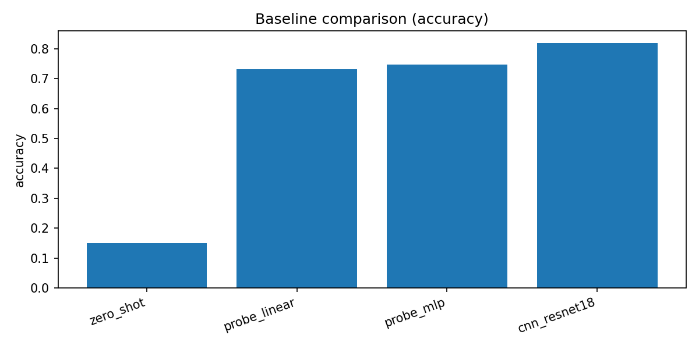
- baseline AUROC: 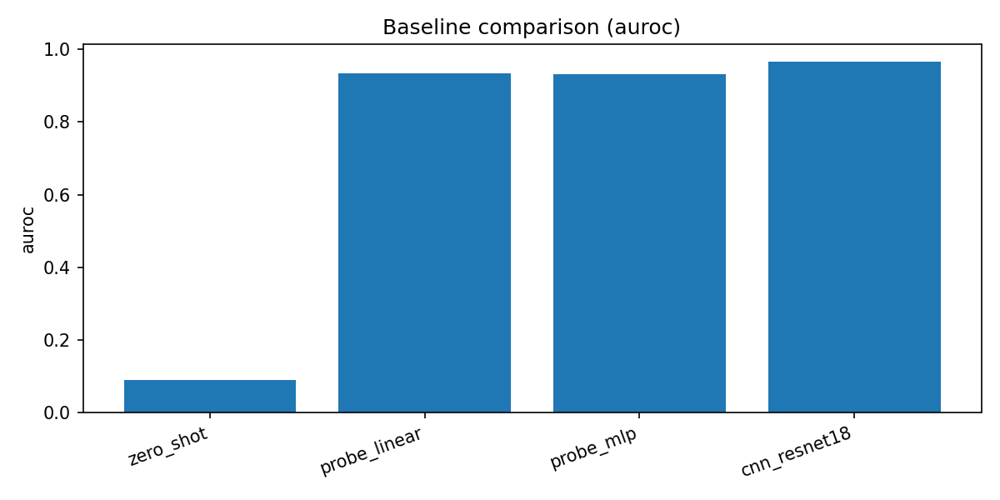
- baseline AUPRC: 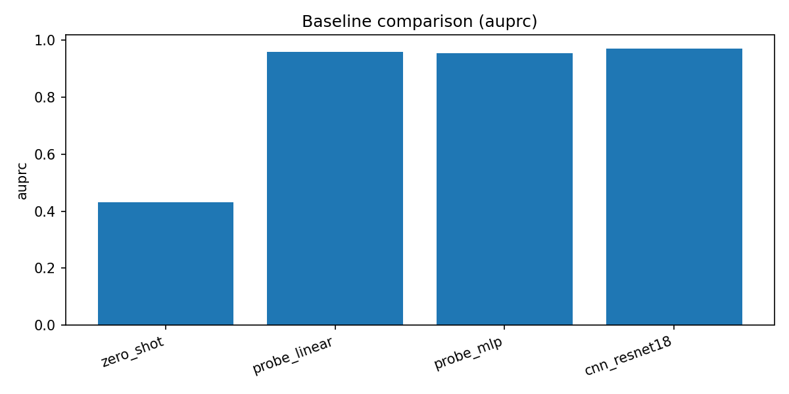
- baseline Recall/Sensitivity: 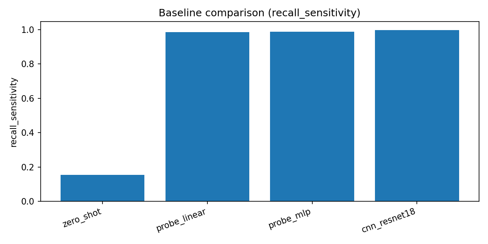
- baseline Specificity: 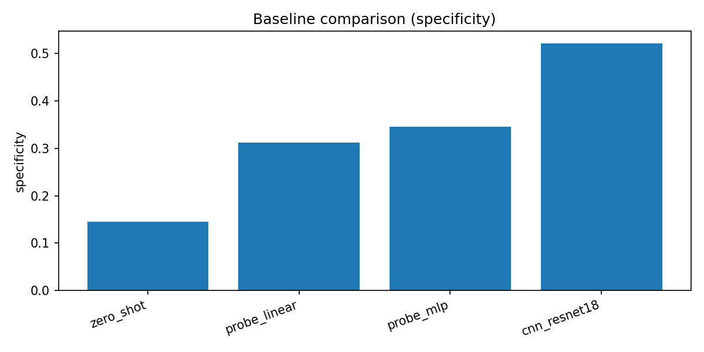

### 5.2 Pooling 消融
- pooling Accuracy: 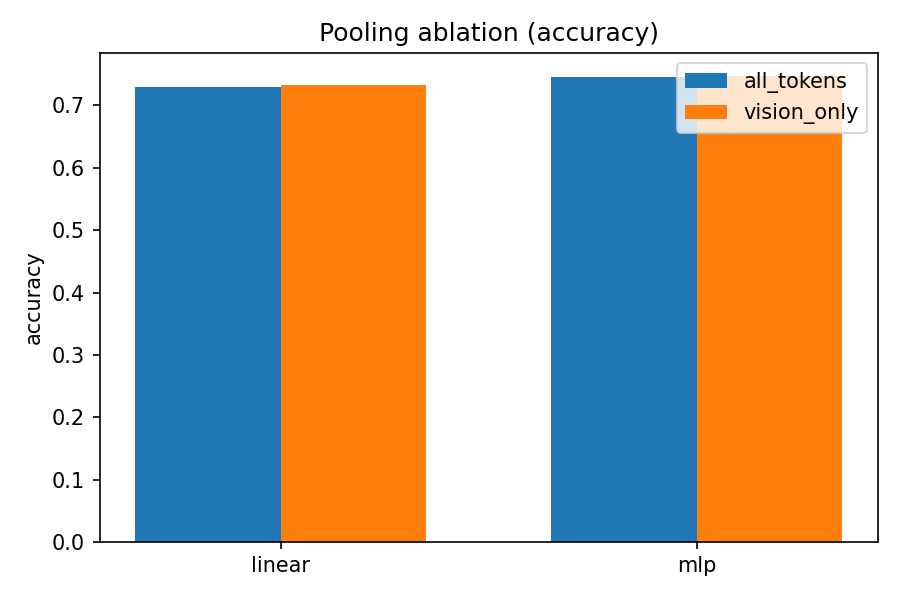
- pooling AUROC: 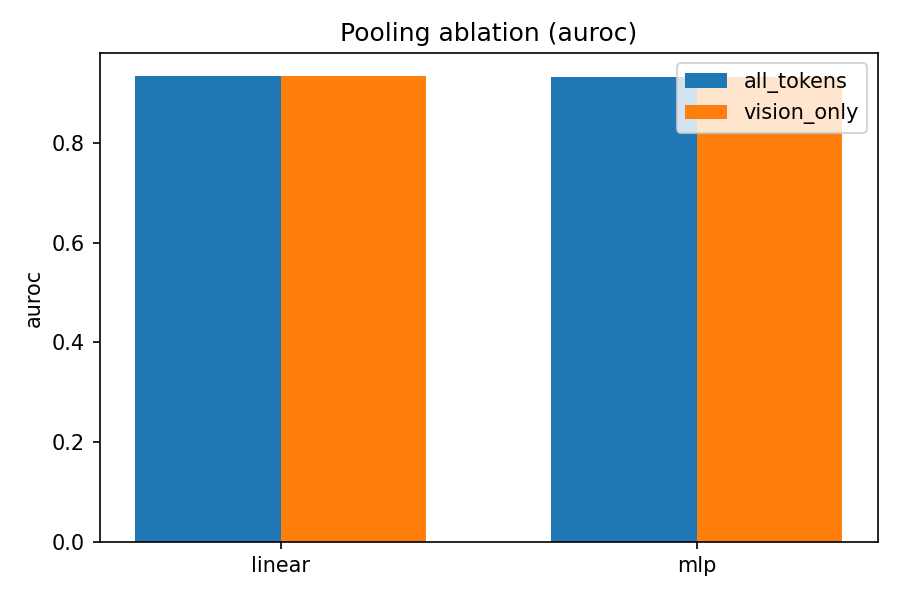
- pooling AUPRC: 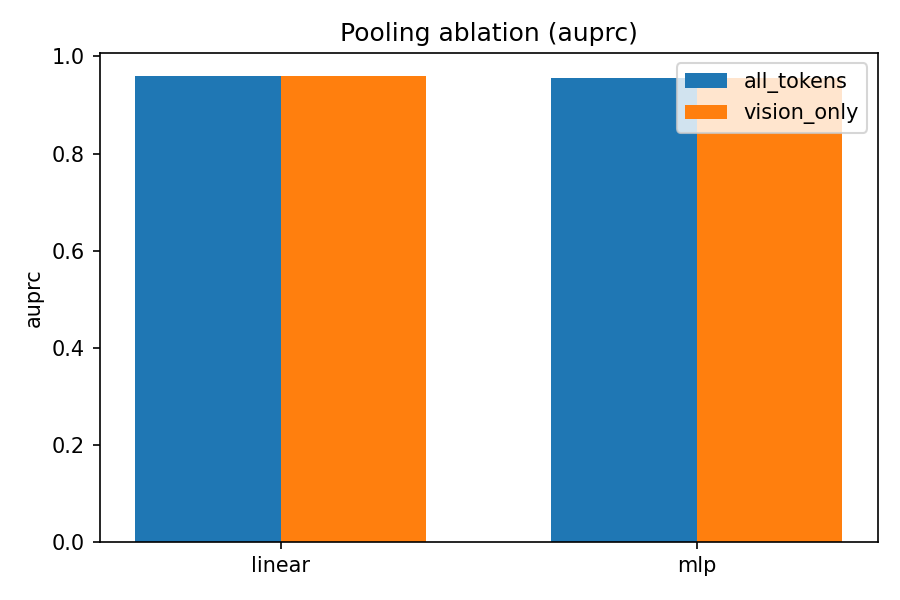
- pooling Recall/Sensitivity: 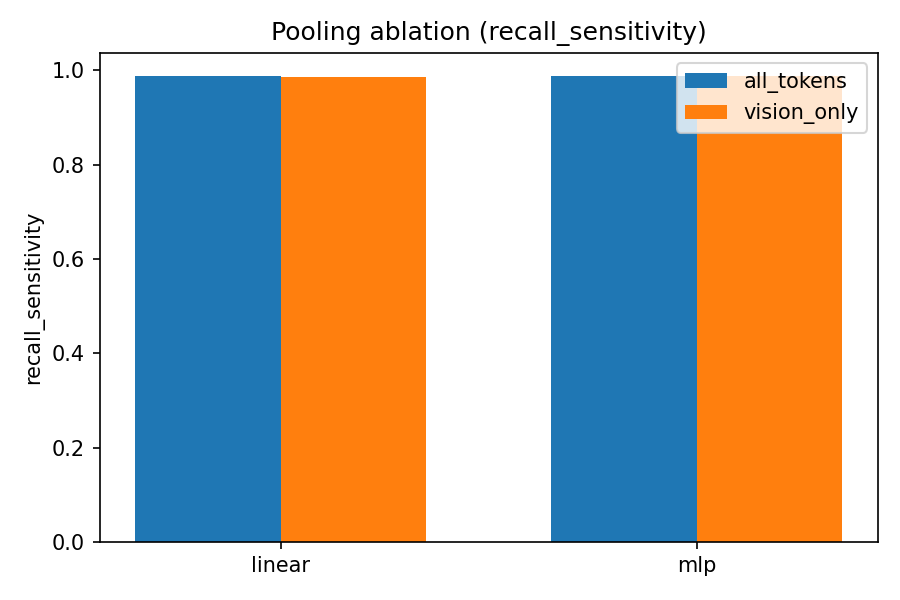
- pooling Specificity: 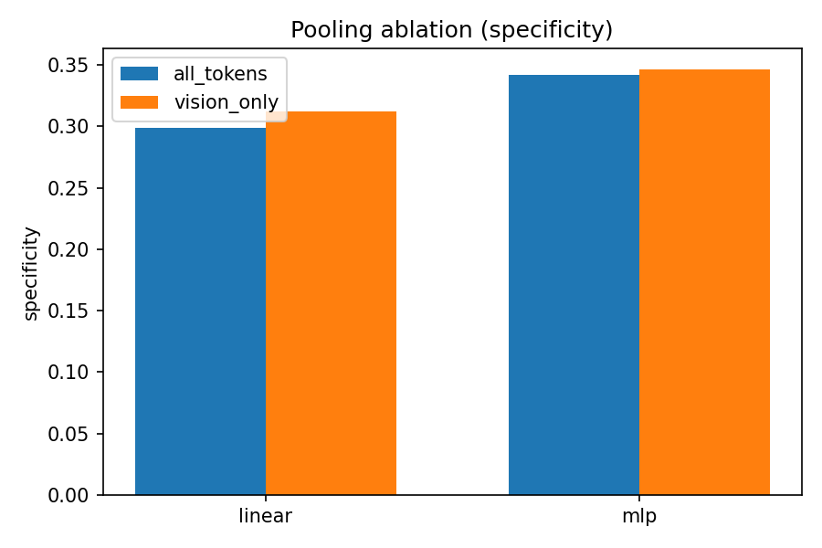

### 5.3 数据效率曲线
- data efficiency Accuracy: 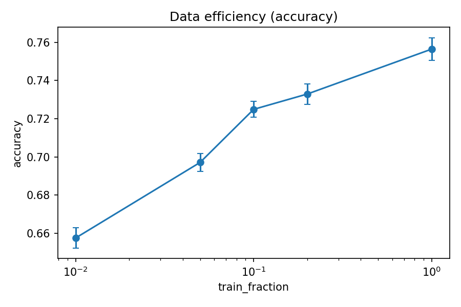
- data efficiency AUROC: 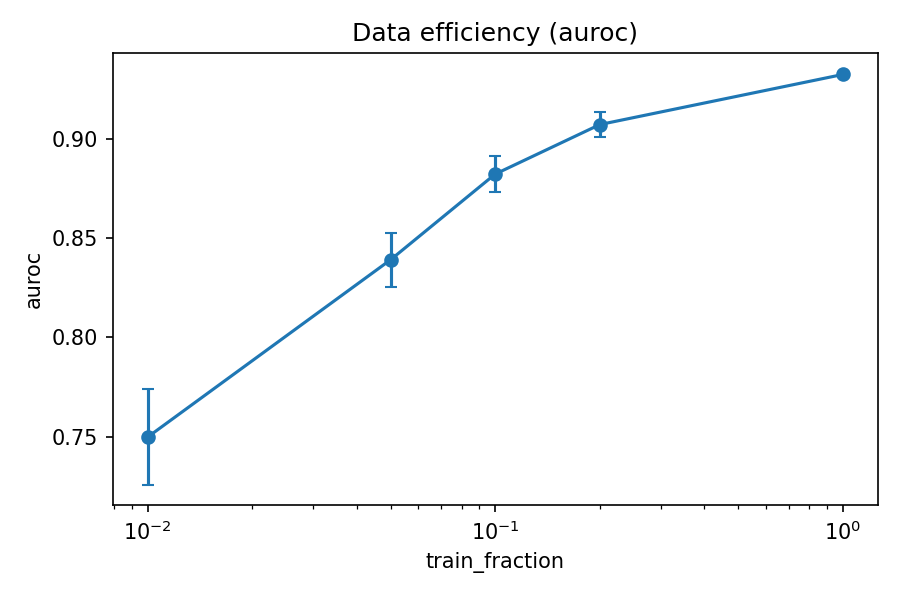
- data efficiency AUPRC: 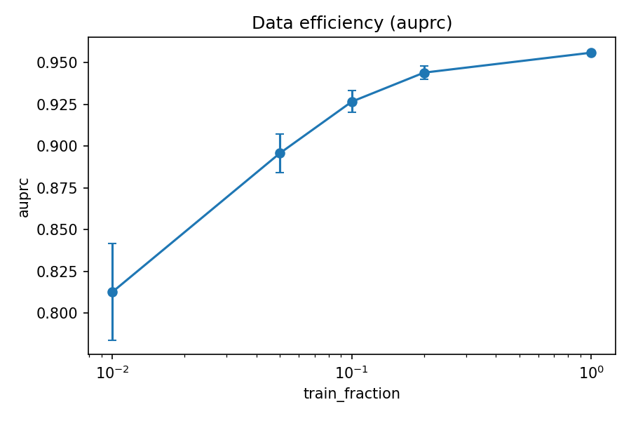
- data efficiency Recall/Sensitivity: 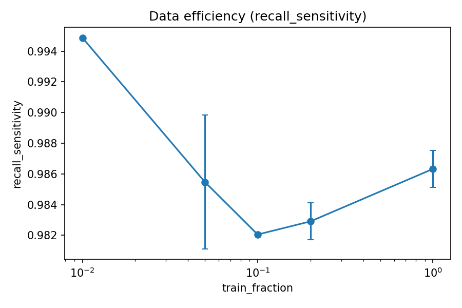
- data efficiency Specificity: 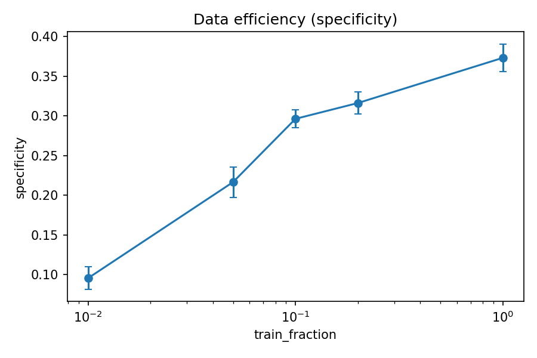

### 5.4 PR 曲线与混淆矩阵
- PR curves: 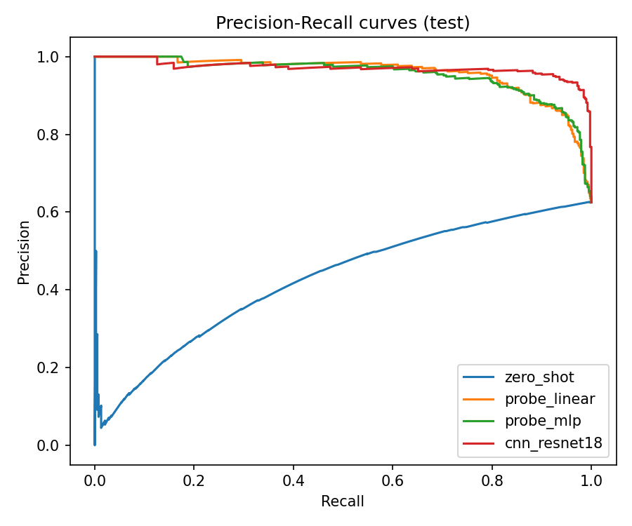
- Confusion matrix zero_shot: 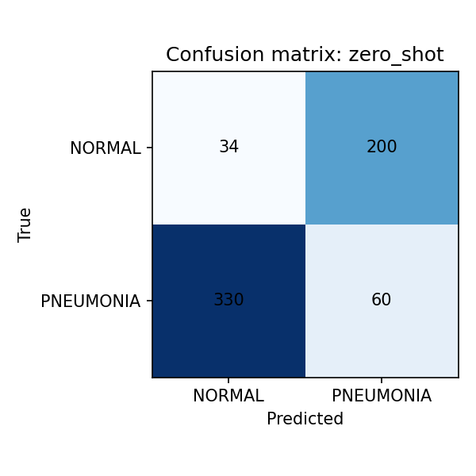
- Confusion matrix probe_linear: 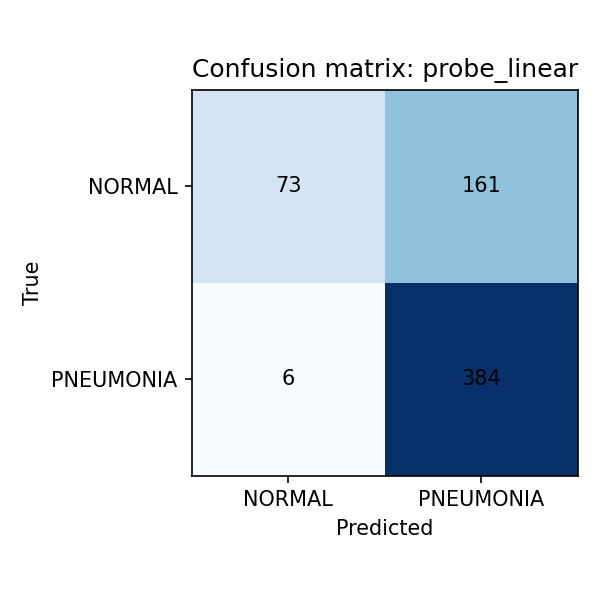
- Confusion matrix probe_mlp: 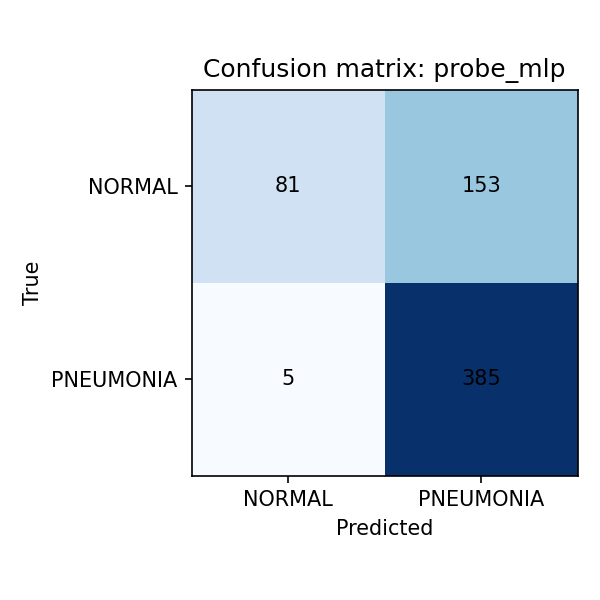
- Confusion matrix cnn_resnet18: 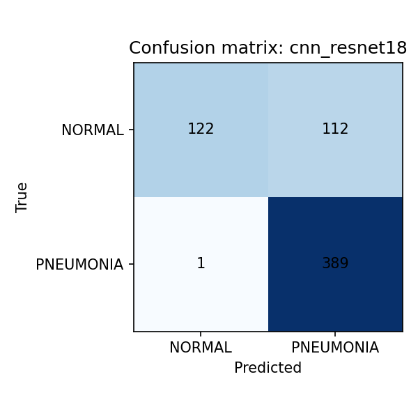

## 6. 逐指标深度解读
### 6.1 Accuracy
- 指标含义与任务相关性
- 该指标下各模型的排名与差距
- 可能的原因分析与误差来源
- 与医学场景的意义解读
- 对后续改进的建议

### 6.2 AUROC
- 指标含义与任务相关性
- 该指标下各模型的排名与差距
- 可能的原因分析与误差来源
- 与医学场景的意义解读
- 对后续改进的建议

### 6.3 AUPRC
- 指标含义与任务相关性
- 该指标下各模型的排名与差距
- 可能的原因分析与误差来源
- 与医学场景的意义解读
- 对后续改进的建议

### 6.4 Recall/Sensitivity
- 指标含义与任务相关性
- 该指标下各模型的排名与差距
- 可能的原因分析与误差来源
- 与医学场景的意义解读
- 对后续改进的建议

### 6.5 Specificity
- 指标含义与任务相关性
- 该指标下各模型的排名与差距
- 可能的原因分析与误差来源
- 与医学场景的意义解读
- 对后续改进的建议

## 7. 模型级深入分析（按模型）
### 7.1 zero_shot
- 方法描述与推理逻辑
- 主要优势
- 主要短板
- Accuracy: 0.1506
- AUROC: 0.0893
- AUPRC: 0.4301
- Recall/Sensitivity: 0.1538
- Specificity: 0.1453
- 与其他模型的对比结论

### 7.2 probe_linear
- 方法描述与推理逻辑
- 主要优势
- 主要短板
- Accuracy: 0.7324
- AUROC: 0.9338
- AUPRC: 0.9588
- Recall/Sensitivity: 0.9846
- Specificity: 0.3120
- 与其他模型的对比结论

### 7.3 probe_mlp
- 方法描述与推理逻辑
- 主要优势
- 主要短板
- Accuracy: 0.7468
- AUROC: 0.9315
- AUPRC: 0.9551
- Recall/Sensitivity: 0.9872
- Specificity: 0.3462
- 与其他模型的对比结论

### 7.4 cnn_resnet18
- 方法描述与推理逻辑
- 主要优势
- 主要短板
- Accuracy: 0.8189
- AUROC: 0.9658
- AUPRC: 0.9705
- Recall/Sensitivity: 0.9974
- Specificity: 0.5214
- 与其他模型的对比结论

## 8. 数据效率逐点分析
### 8.001 训练比例=0.01
- Accuracy: 均值=0.6576, 标准差=0.0053
  - 该比例下的稳定性评估
  - 与更高比例的对比趋势
- AUROC: 均值=0.7498, 标准差=0.0241
  - 该比例下的稳定性评估
  - 与更高比例的对比趋势
- AUPRC: 均值=0.8128, 标准差=0.0289
  - 该比例下的稳定性评估
  - 与更高比例的对比趋势
- Recall/Sensitivity: 均值=0.9949, 标准差=0.0000
  - 该比例下的稳定性评估
  - 与更高比例的对比趋势
- Specificity: 均值=0.0954, 标准差=0.0141
  - 该比例下的稳定性评估
  - 与更高比例的对比趋势

### 8.005 训练比例=0.05
- Accuracy: 均值=0.6971, 标准差=0.0047
  - 该比例下的稳定性评估
  - 与更高比例的对比趋势
- AUROC: 均值=0.8392, 标准差=0.0137
  - 该比例下的稳定性评估
  - 与更高比例的对比趋势
- AUPRC: 均值=0.8958, 标准差=0.0115
  - 该比例下的稳定性评估
  - 与更高比例的对比趋势
- Recall/Sensitivity: 均值=0.9855, 标准差=0.0044
  - 该比例下的稳定性评估
  - 与更高比例的对比趋势
- Specificity: 均值=0.2165, 标准差=0.0192
  - 该比例下的稳定性评估
  - 与更高比例的对比趋势

### 8.01 训练比例=0.10
- Accuracy: 均值=0.7249, 标准差=0.0042
  - 该比例下的稳定性评估
  - 与更高比例的对比趋势
- AUROC: 均值=0.8824, 标准差=0.0089
  - 该比例下的稳定性评估
  - 与更高比例的对比趋势
- AUPRC: 均值=0.9267, 标准差=0.0065
  - 该比例下的稳定性评估
  - 与更高比例的对比趋势
- Recall/Sensitivity: 均值=0.9821, 标准差=0.0000
  - 该比例下的稳定性评估
  - 与更高比例的对比趋势
- Specificity: 均值=0.2963, 标准差=0.0112
  - 该比例下的稳定性评估
  - 与更高比例的对比趋势

### 8.02 训练比例=0.20
- Accuracy: 均值=0.7329, 标准差=0.0053
  - 该比例下的稳定性评估
  - 与更高比例的对比趋势
- AUROC: 均值=0.9073, 标准差=0.0062
  - 该比例下的稳定性评估
  - 与更高比例的对比趋势
- AUPRC: 均值=0.9441, 标准差=0.0040
  - 该比例下的稳定性评估
  - 与更高比例的对比趋势
- Recall/Sensitivity: 均值=0.9829, 标准差=0.0012
  - 该比例下的稳定性评估
  - 与更高比例的对比趋势
- Specificity: 均值=0.3162, 标准差=0.0140
  - 该比例下的稳定性评估
  - 与更高比例的对比趋势

### 8.10 训练比例=1.00
- Accuracy: 均值=0.7564, 标准差=0.0060
  - 该比例下的稳定性评估
  - 与更高比例的对比趋势
- AUROC: 均值=0.9326, 标准差=0.0005
  - 该比例下的稳定性评估
  - 与更高比例的对比趋势
- AUPRC: 均值=0.9560, 标准差=0.0006
  - 该比例下的稳定性评估
  - 与更高比例的对比趋势
- Recall/Sensitivity: 均值=0.9863, 标准差=0.0012
  - 该比例下的稳定性评估
  - 与更高比例的对比趋势
- Specificity: 均值=0.3732, 标准差=0.0176
  - 该比例下的稳定性评估
  - 与更高比例的对比趋势

## 9. 结论与建议
- CNN baseline 在总体性能上仍为最优
- Probe 方法在 recall 上优势明显，但 specificity 需要关注
- Pooling 消融差异小，但 vision_only 更安全
- 小样本下 VLM 表征仍有可用性能，适合数据稀缺场景

## 10. 附录：复现实验清单
- Step 1: python scripts/build_splits.py ...
- Step 2: sbatch sbatch/run_extract_embeddings_pooling.sbatch
- Step 3: sbatch sbatch/run_zero_shot.sbatch
- Step 4: sbatch sbatch/run_probe_pooling.sbatch
- Step 5: sbatch sbatch/run_cnn_resnet18.sbatch
- Step 6: sbatch sbatch/run_data_efficiency_vision_only.sbatch

## 11. 附录：指标定义（逐条）
- Accuracy: 定义与计算方式
  - 适用场景
  - 该任务的重要性

- AUROC: 定义与计算方式
  - 适用场景
  - 该任务的重要性

- AUPRC: 定义与计算方式
  - 适用场景
  - 该任务的重要性

- Recall/Sensitivity: 定义与计算方式
  - 适用场景
  - 该任务的重要性

- Specificity: 定义与计算方式
  - 适用场景
  - 该任务的重要性

## 12. 附录：风险与偏差清单
- 风险项 01: 数据分布/标注/模型偏差/评估误差
- 风险项 02: 数据分布/标注/模型偏差/评估误差
- 风险项 03: 数据分布/标注/模型偏差/评估误差
- 风险项 04: 数据分布/标注/模型偏差/评估误差
- 风险项 05: 数据分布/标注/模型偏差/评估误差
- 风险项 06: 数据分布/标注/模型偏差/评估误差
- 风险项 07: 数据分布/标注/模型偏差/评估误差
- 风险项 08: 数据分布/标注/模型偏差/评估误差
- 风险项 09: 数据分布/标注/模型偏差/评估误差
- 风险项 10: 数据分布/标注/模型偏差/评估误差
- 风险项 11: 数据分布/标注/模型偏差/评估误差
- 风险项 12: 数据分布/标注/模型偏差/评估误差
- 风险项 13: 数据分布/标注/模型偏差/评估误差
- 风险项 14: 数据分布/标注/模型偏差/评估误差
- 风险项 15: 数据分布/标注/模型偏差/评估误差
- 风险项 16: 数据分布/标注/模型偏差/评估误差
- 风险项 17: 数据分布/标注/模型偏差/评估误差
- 风险项 18: 数据分布/标注/模型偏差/评估误差
- 风险项 19: 数据分布/标注/模型偏差/评估误差
- 风险项 20: 数据分布/标注/模型偏差/评估误差
- 风险项 21: 数据分布/标注/模型偏差/评估误差
- 风险项 22: 数据分布/标注/模型偏差/评估误差
- 风险项 23: 数据分布/标注/模型偏差/评估误差
- 风险项 24: 数据分布/标注/模型偏差/评估误差
- 风险项 25: 数据分布/标注/模型偏差/评估误差
- 风险项 26: 数据分布/标注/模型偏差/评估误差
- 风险项 27: 数据分布/标注/模型偏差/评估误差
- 风险项 28: 数据分布/标注/模型偏差/评估误差
- 风险项 29: 数据分布/标注/模型偏差/评估误差
- 风险项 30: 数据分布/标注/模型偏差/评估误差
- 风险项 31: 数据分布/标注/模型偏差/评估误差
- 风险项 32: 数据分布/标注/模型偏差/评估误差
- 风险项 33: 数据分布/标注/模型偏差/评估误差
- 风险项 34: 数据分布/标注/模型偏差/评估误差
- 风险项 35: 数据分布/标注/模型偏差/评估误差
- 风险项 36: 数据分布/标注/模型偏差/评估误差
- 风险项 37: 数据分布/标注/模型偏差/评估误差
- 风险项 38: 数据分布/标注/模型偏差/评估误差
- 风险项 39: 数据分布/标注/模型偏差/评估误差
- 风险项 40: 数据分布/标注/模型偏差/评估误差
- 风险项 41: 数据分布/标注/模型偏差/评估误差
- 风险项 42: 数据分布/标注/模型偏差/评估误差
- 风险项 43: 数据分布/标注/模型偏差/评估误差
- 风险项 44: 数据分布/标注/模型偏差/评估误差
- 风险项 45: 数据分布/标注/模型偏差/评估误差
- 风险项 46: 数据分布/标注/模型偏差/评估误差
- 风险项 47: 数据分布/标注/模型偏差/评估误差
- 风险项 48: 数据分布/标注/模型偏差/评估误差
- 风险项 49: 数据分布/标注/模型偏差/评估误差
- 风险项 50: 数据分布/标注/模型偏差/评估误差

