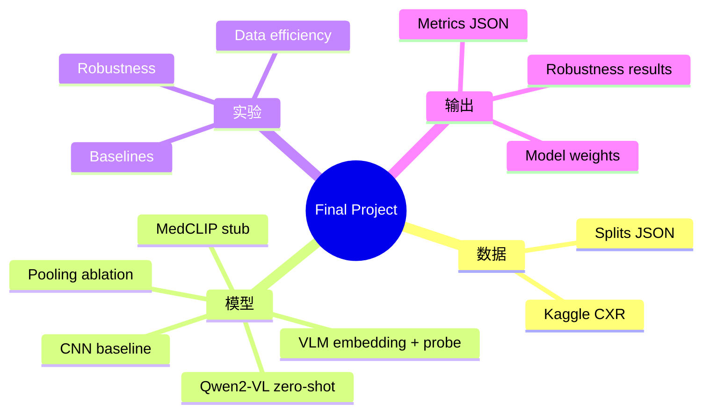
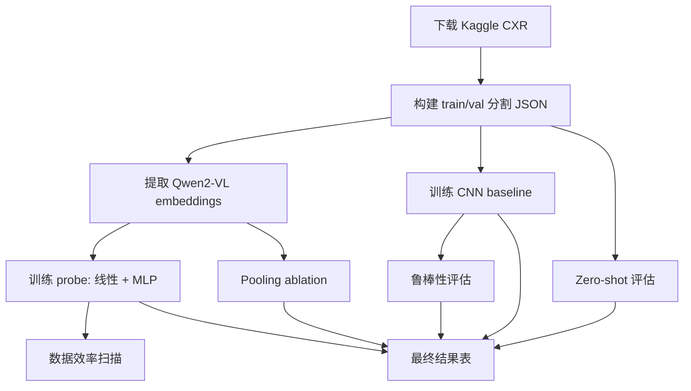

# 项目详解文档

本文档详细说明已实现的实验流程、参数配置、运行方式与产出文件，便于直接写入 final report。

---

## 1) 项目思维导图（已实现内容）



---

## 2) 实验流程图（数据到结果）



---

## 3) 运行架构（组件与产物）


---

## 4) 实验组与设置（已实现）

### A) Baselines（主对照）

- **Zero-shot baseline (Qwen2-VL)**
  - 脚本：`scripts/evaluate_zero_shot.py`
  - 评分方式：候选答案 log-likelihood（NORMAL vs PNEUMONIA）
  - 输出：`output/zero_shot_results.json`

- **VLM Embeddings + Linear Probe**
  - 脚本：`scripts/train_probe.py --model_type linear`
  - 输入：`embeddings/train.pt` / `val.pt` / `test.pt`
  - 输出：`output/probe_linear_*.json` 与 `output/probe_linear.pt`

- **VLM Embeddings + MLP**
  - 脚本：`scripts/train_probe.py --model_type mlp`
  - 默认：hidden_dim=256, dropout=0.3
  - 输出：`output/probe_mlp_*.json` 与 `output/probe_mlp.pt`

- **CNN baseline (ResNet/DenseNet)**
  - 脚本：`scripts/train_cnn.py`
  - 模型：resnet18, resnet50, densenet121
  - 输出：`output/cnn_resnet18.json` + `.pt`

- **Medical CLIP baseline**
  - 脚本：`scripts/medclip_baseline.py`（可插拔 stub）
  - TODO：选择 repo / 权重后补充实现

### B) 数据效率（主改进方向）

- 脚本：`scripts/train_probe.py` + `--train_fraction`
- 比例：1%、5%、10%、20%、100%
- 随机种子：1、2、3
- 输出：每次运行一个 JSON，用于计算均值/方差并画学习曲线

### C) 鲁棒性（次改进方向）
### D) Pooling 消融（新增实验组）

- 目的：避免文本 token 混入图像表征，确保可解释且可比
- 对比：`all_tokens` vs `vision_only`
- 影响：embedding 提取与 probe 训练
- 输出目录：
  - `embeddings/all_tokens/`
  - `embeddings/vision_only/`
  - `output/probe_all_tokens/`
  - `output/probe_vision_only/`

- 脚本：`scripts/robustness_eval.py`
- 扰动：brightness, contrast, rotation, blur, noise
- 强度：低/中档（见脚本内定义）
- 输出：`output/robustness_results.json`

---

## 5) 关键代码片段

### Zero-shot log-likelihood 评分

```python
probs = score_candidates(
    model, processor, images, ["NORMAL", "PNEUMONIA"], device, length_norm
)
# pneumonia_probs = probs[:, 1]
```

### 构建确定性数据分割

```python
python scripts/build_splits.py \
  --dataset_dir ./data/chest_xray \
  --val_fraction 0.1 \
  --seed 42 \
  --output_file ./splits/full_split.json
```

### 数据效率扫描
### Pooling 消融运行示例

```bash
python scripts/extract_embeddings.py \
  --split_file ./splits/full_split.json \
  --model ./models/Qwen2-VL-2B-Instruct \
  --device cuda \
  --batch_size 8 \
  --pooling all_tokens \
  --output_dir ./embeddings/all_tokens

python scripts/extract_embeddings.py \
  --split_file ./splits/full_split.json \
  --model ./models/Qwen2-VL-2B-Instruct \
  --device cuda \
  --batch_size 8 \
  --pooling vision_only \
  --output_dir ./embeddings/vision_only
```

```bash
for frac in 0.01 0.05 0.1 0.2 1.0; do
  for seed in 1 2 3; do
    python scripts/train_probe.py \
      --embedding_dir ./embeddings \
      --model_type mlp \
      --train_fraction "$frac" \
      --seed "$seed" \
      --output_dir ./output
  done
 done
```

---

## 6) Final report 需要的输出

- `output/zero_shot_results.json`
- `output/probe_all_tokens/pooling_all_tokens_probe_*.json`
- `output/probe_vision_only/pooling_vision_only_probe_*.json`
- `output/cnn_resnet18.json`（或其他 CNN 结果）
- `output/robustness_results.json`

这些 JSON 是最终结果表与曲线的直接来源。

---

## 7) H800 执行方式

- 一键脚本：`scripts/run_all_experiments.sh`
- sbatch 封装：`sbatch/run_all_experiments.sbatch`
- 提交前需要改：
  - `PROJECT_ROOT`
  - `ENV_PATH`

---

## 8) 已知 TODO（保留可插拔）

- Medical CLIP baseline（选择 repo/权重后补充实现到 `medclip_baseline.py`）
- 可选：加入 pooling 消融（vision-only vs all-tokens），需重新提取 embeddings
