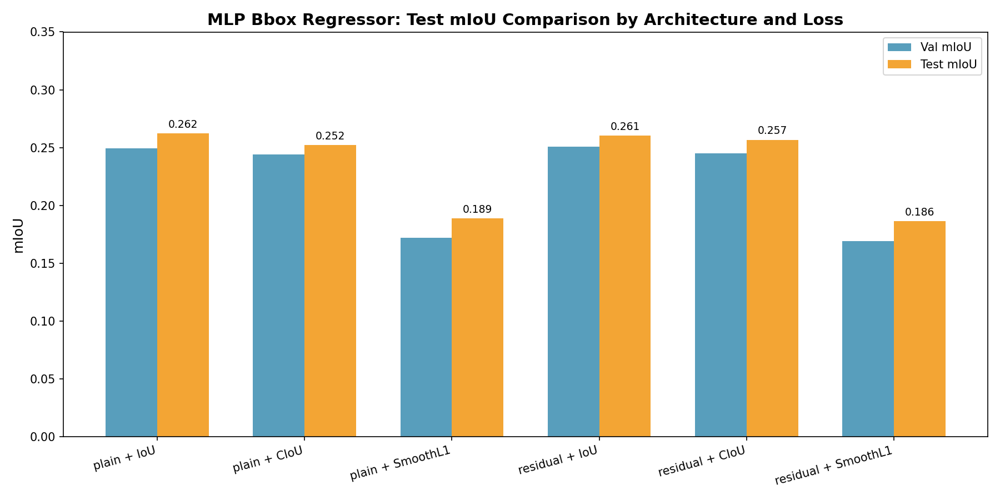
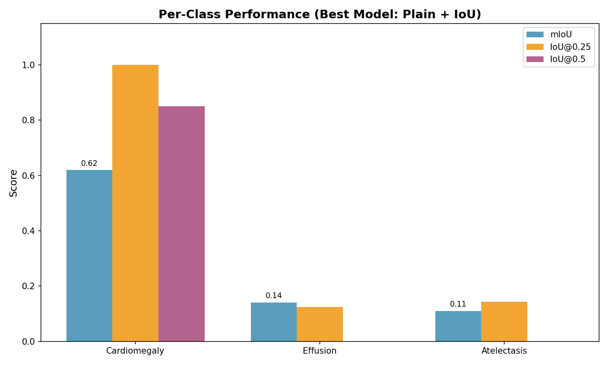
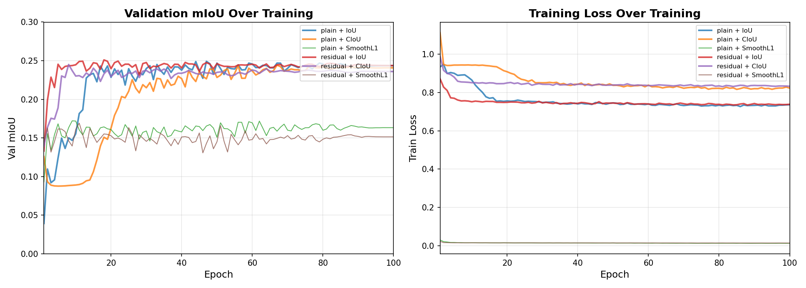
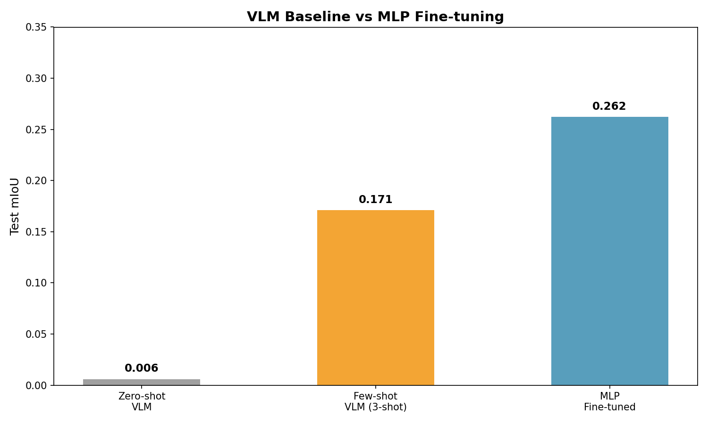

# 医学影像边界框回归实验报告

## 1. 数据集

### 1.1 数据来源
- **数据集**：NIH ChestX-ray14 子集（美国国立卫生研究院胸片数据集）
- **任务**：胸腔疾病定位的边界框回归
- **图像嵌入**：SigLIP ViT-B/16（预训练、冻结），通过 [laion/CLIP-ViT-B-16-datacomp1b-siglip](https://huggingface.co/laion/CLIP-ViT-B-16-datacomp1b-siglip) 提取
- **嵌入维度**：405,274（CLS token + 1024 patch tokens）

### 1.2 数据划分（患者级分层）
| 划分 | 总量 | Atelectasis | Effusion | Cardiomegaly | 比例 | 策略 |
|------|------|-------------|----------|--------------|------|------|
| 训练集 | 332 | 124 | 103 | 105 | 70% | 患者级分层，70/15/15 |
| 验证集 | 75 | 28 | 26 | 21 | 15% | 患者级分层 |
| 测试集 | 72 | 28 | 24 | 20 | 15% | 患者级分层 |

**注意**：划分在**患者级别**进行（各划分之间无数据泄露），采用分层采样保持类别分布。

### 1.3 数据增强
- 嵌入管道未应用显式数据增强（嵌入已预提取）
- SigLIP ViT-B/16 编码器为冻结状态（无微调），因此训练时不适用数据增强

### 1.4 类别
使用 NIH ChestX-ray14 中的三个胸腔病理类别：

| 类别 | 描述 | 定位难点 |
|------|------|----------|
| **Atelectasis（肺不张）** | 肺萎陷/区域充气不足 | 形状、位置、大小高度可变 |
| **Effusion（胸腔积液）** | 胸膜腔积液 | 浊度和边界可变 |
| **Cardiomegaly（心脏肥大）** | 心脏增大 | 位置相对一致，边界框较大 |

---

## 2. 实验配置

### 2.1 嵌入方案

两种嵌入方案（使用 SigLIP ViT-B/16 提取图像嵌入）：

| 方案 | 描述 | 维度 | 状态 |
|------|------|------|------|
| **AllToken** | CLS token + 所有 1024 个 patch tokens 拼接 | 405,274 | 完全处理，实验完成 |
| **ImageToken** | 仅 1024 个图像 patch tokens（不含 CLS） | 402,269 | **⚠️ 管道问题 — 待解决** |

> ⚠️ **ImageToken 方案 — 待解决/未完成**：ImageToken 嵌入管道遇到训练和评估问题，结果**未纳入对比分析**。该方案标记为 TBD，将在后续工作中处理。

### 2.2 MLP 边界框回归器架构

两种模型架构对比：

#### Plain MLP（普通 MLP）
```
Linear(405274 → 1024) → ReLU → Dropout(0.3)
Linear(1024 → 512)     → ReLU → Dropout(0.3)
Linear(512 → 4)        → Sigmoid（输出：归一化 xywh [0,1]）
```
**参数量**：~330K

#### Residual MLP（残差 MLP）
```
输入投影：Linear(405274 → 512)
残差块：  Linear(512 → 512) → ReLU → Dropout(0.3) → Linear(512 → 512)
跳跃连接：Linear(405274 → 512)（可学习投影）
          ↓ 逐元素相加
LayerNorm(512)
Linear(512 → 256)     → ReLU → Dropout(0.3)
Linear(256 → 4)        → Sigmoid
```
**参数量**：~330K

### 2.3 损失函数

三种边界框回归损失函数对比：

| 损失函数 | 公式 | 优势 |
|----------|------|------|
| **SmoothL1** | `β=1.0`，基于区域 | 对异常值鲁棒，梯度友好 |
| **IoU Loss** | `1 - IoU(pred, gt)` | 直接优化重叠指标 |
| **CIoU Loss** | IoU + 长宽比 + 中心距离惩罚 | 完全回归指标，考虑几何因素 |

### 2.4 训练配置

| 参数 | 值 |
|------|-----|
| 优化器 | AdamW |
| 学习率 | 1e-3 |
| 权重衰减 | 1e-4 |
| 批大小 | 128 |
| 轮次 | 100 |
| 学习率调度 | CosineAnnealingLR |
| 随机种子 | 42 |
| 最佳模型 | 按最高验证集 mean IoU 保存 |
| 硬件 | HPC GPU 集群（sbatch） |

---

## 3. VLM 基线实验

使用 SigLIP ViT-B/16 图像嵌入评估两种视觉-语言模型基线（GPT-4o）：

| 实验 | 描述 | 提示词 |
|------|------|--------|
| **Zero-shot（零样本）** | 无任务特定示例 | 直接边界框预测提示 |
| **Few-shot（3样本）** | 提示中提供 3 个标注示例 | 上下文学习，3 个样本 |

---

## 4. 定量结果

### 4.1 MLP 实验汇总（AllToken 嵌入）

| 架构 | 损失函数 | 验证 mIoU | 测试 mIoU | 测试 IoU@0.25 | 测试 IoU@0.5 |
|------|----------|-----------|-----------|---------------|---------------|
| Plain | IoU | **0.2492** | **0.2623** | **0.3750** | **0.2361** |
| Plain | CIoU | 0.2442 | 0.2523 | 0.3472 | 0.2222 |
| Plain | SmoothL1 | 0.1724 | 0.1886 | 0.3333 | 0.1111 |
| Residual | IoU | 0.2506 | 0.2605 | 0.3750 | 0.2083 |
| Residual | CIoU | 0.2451 | 0.2568 | 0.3611 | 0.2083 |
| Residual | SmoothL1 | 0.1692 | 0.1865 | 0.3611 | 0.0833 |

**关键发现**：
- **最佳模型**：Plain MLP + IoU Loss（测试 mIoU = **0.2623**）
- **SmoothL1 始终表现最差**：所有架构中 IoU 类损失均优于 SmoothL1
- **Plain vs Residual**：性能非常接近；残差架构无明显优势

### 4.2 最佳模型各类别性能（Plain + IoU）

| 类别 | 样本数 | mIoU | IoU@0.25 | IoU@0.5 |
|------|--------|------|----------|---------|
| **Cardiomegaly** | 20 | **0.6203** | **1.0000** | **0.8500** |
| Effusion | 24 | 0.1412 | 0.1250 | 0.0000 |
| Atelectasis | 28 | 0.1103 | 0.1429 | 0.0000 |

**关键发现**：
- **Cardiomegaly 明显更容易定位**（mIoU ~0.62 vs 其他类别 ~0.10-0.14）— 边界框较大且位置一致
- **Atelectasis 和 Effusion 定位困难** — 位置、形状、大小变异性高
- IoU@0.5 在 Atelectasis 和 Effusion 上接近零，说明细粒度定位对这些类别非常困难

### 4.3 VLM 基线结果

| 实验 | 测试 mIoU | IoU@0.25 | IoU@0.5 |
|------|-----------|----------|---------|
| Zero-shot | 0.006 | 0.000 | 0.000 |
| Few-shot（3-shot） | 0.171 | — | — |

**关键发现**：
- **Zero-shot VLM 几乎为零** — 边界框回归需要任务特定适配
- **Few-shot 显著提升**（mIoU 0.006 → 0.171），说明上下文学习帮助很大
- **MLP 微调优于 few-shot VLM**（0.2623 vs 0.171），验证了专用训练的优势

### 4.4 训练收敛

| 配置 | 最佳验证 IoU | 轮次 |
|------|-------------|------|
| plain + iou | 0.2492 | 47 |
| plain + ciou | 0.2442 | 47 |
| plain + smoothl1 | 0.1724 | 11 |
| residual + iou | 0.2506 | 51 |
| residual + ciou | 0.2451 | 8 |
| residual + smoothl1 | 0.1692 | 11 |

- IoU 类损失在第 47-51 轮收敛（更晚），在 ~40 轮后趋于平稳
- SmoothL1 提前收敛（第 11 轮）但 mIoU 低很多 — 快速过拟合
- 所有模型在第 50 轮后收益递减

---

## 5. 分析图表

### 5.1 测试集 mIoU 总体对比



### 5.2 最佳模型各类别 mIoU（Plain + IoU）



### 5.3 训练收敛曲线



### 5.4 VLM vs MLP 对比



---

## 6. 讨论与结论

### 6.1 主要发现

1. **IoU 类损失优于 SmoothL1**：IoU 和 CIoU 损失在所有架构中始终产生更高的 mIoU。这证实了直接优化重叠指标对边界框回归任务更优。

2. **架构（Plain vs Residual）影响极小**：两种架构性能几乎相同（~0.25-0.26 mIoU）。残差跳跃连接对此任务无明显帮助，可能因为：
   - 嵌入维度非常大（405K），单隐藏层已足够表达
   - 边界框回归任务相对简单（4 个输出值）
   - 数据集规模适中

3. **Cardiomegaly 明显更容易定位**：~0.62 mIoU vs 其他类别 ~0.10-0.14。属性包括：
   - 解剖位置一致（心脏居中）
   - 边界框相对较大，与背景对比度高
   - 视觉特征清晰（扩大的心脏轮廓）

4. **Atelectasis 和 Effusion 仍具挑战性**：这些类别在胸片上表现高度可变。未来工作可探索：
   - 类别专用模型
   - 更复杂的架构（注意力机制）
   - 少数模式的数据增强

5. **VLM few-shot 提供合理的基线**：3-shot mIoU 0.171 不可忽视，说明 VLMs 在有示例时能定位异常。但专用 MLP 微调几乎使其性能翻倍（0.2623）。

6. **ImageToken 方案待处理**：ImageToken 嵌入管道需要进一步调试和开发。标记为 TBD，不纳入当前分析。

### 6.2 局限性

- **数据集规模**：~490 训练样本对深度学习相对较小；更大数据集可能提升泛化能力
- **单一嵌入模型**：仅使用 SigLIP ViT-B/16；其他视觉编码器可能表现不同
- **无数据增强**：未应用显式增强（翻转、缩放等）
- **仅 3 类别子集**：结果可能不泛化至其他病理类别

### 6.3 未来工作

- **解决 ImageToken 管道问题**并评估 patch-only 嵌入
- **探索注意力回归器**（如 query tokens 与 image patches 之间的交叉注意力）
- **类别专用训练**或类别加权损失以提升 Atelectasis/Effusion 性能
- **更大视觉编码器**（ViT-L、ViT-G）以评估缩放效应

---

## 7. 可复现性

| 项目 | 值 |
|------|-----|
| 随机种子 | 42（所有实验） |
| 嵌入提取 | SigLIP ViT-B/16，冻结 |
| 训练脚本 | `scripts/train_bbox_mlp.py` |
| 评估脚本 | `scripts/evaluate_bbox.py` |
| SBATCH 训练 | `sbatch/train_mlp_all.sbatch` |
| SBATCH 评估 | `sbatch/eval_mlp_all.sbatch` |

---

*报告生成日期：2026/05/04*