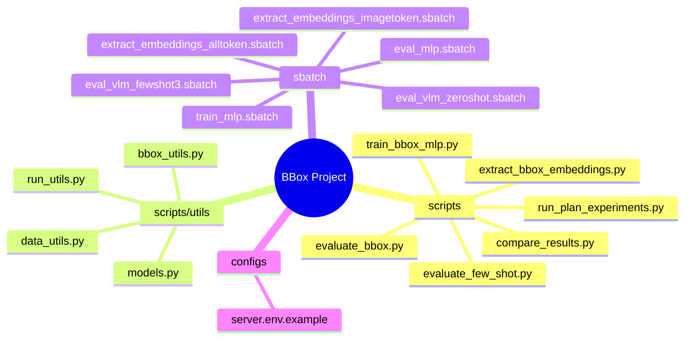
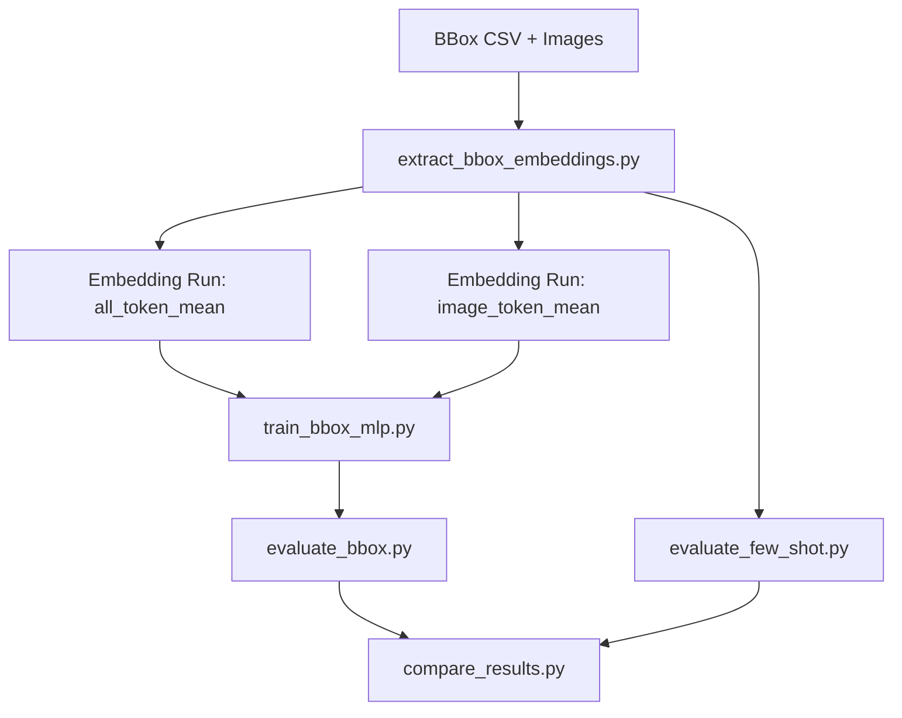
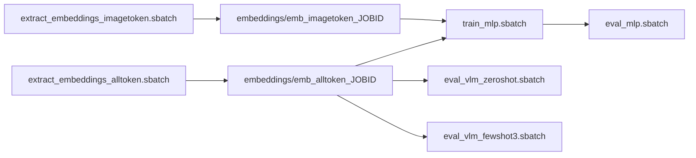

# 项目实现详解（VLM + MLP BBox Localization）

本文档对应本次重构后的代码实现，覆盖：架构、实验组、关键参数、运行方式、Slurm 提交、结果管理策略。

---

## 1. 本次完成的核心工作

1. 重构了 `scripts/` 代码结构，抽离公共模块到 `scripts/utils/`
2. 实现了计划中的关键实验维度：
   - Embedding: `all_token_mean` / `image_token_mean`
   - MLP: `plain` / `residual`
   - Loss: `smoothl1` / `iou` / `ciou`
3. 全流程统一 box 归一化 `(x/W, y/H, w/W, h/H)`
4. 加入防覆盖机制（所有阶段都按 `run_name` 输出独立目录）
5. 提供 H800 的 sbatch 提交模板（embedding/训练/eval/baseline）
6. 清理旧的最小验证产物（旧 `embeddings/`、`output/` 文件已删除）

---

## 2. 重构后的代码架构



---

## 3. 训练与推理流程



---

## 4. 实验组与代码参数映射

| 维度 | 实验组 | 对应参数 |
|---|---|---|
| Baseline | B0/B1 | `evaluate_few_shot.py --n_shot 0/3` |
| Embedding | E1/E2 | `extract_bbox_embeddings.py --embedding_mode all_token_mean/image_token_mean` |
| MLP 架构 | A1/A2 | `train_bbox_mlp.py --arch plain/residual` |
| Loss | L1/L2/L3 | `train_bbox_mlp.py --loss smoothl1/iou/ciou` |

---

## 5. 关键实现细节（含代码片段）

## 5.1 防覆盖输出目录

来源：`scripts/utils/run_utils.py`

```python
def prepare_run_dir(output_root, run_name, prefix, allow_overwrite=False):
    run = run_name or default_run_name(prefix)
    run_dir = out_root / run
    if run_dir.exists() and not allow_overwrite:
        raise FileExistsError(...)
```

每个阶段（embedding/train/eval/baseline/compare）都通过该函数创建 run 目录，默认不允许覆盖。

## 5.2 归一化框

来源：`scripts/utils/bbox_utils.py`

```python
def normalize_xywh(box_xywh, sizes_wh):
    out[..., 0] = out[..., 0] / W
    out[..., 1] = out[..., 1] / H
    out[..., 2] = out[..., 2] / W
    out[..., 3] = out[..., 3] / H
```

训练损失和指标都在归一化坐标上计算，评估可反归一化用于可视化。

## 5.3 Embedding 两种池化

来源：`scripts/extract_bbox_embeddings.py`

```python
if mode == "all_token_mean":
    emb = hidden_states.mean(dim=1)
else:
    mask = (input_ids == image_token_id)
    emb = (hidden_states * mask).sum(dim=1) / mask.sum(dim=1)
```

## 5.4 Loss 三组

来源：`scripts/train_bbox_mlp.py`

```python
if loss == "smoothl1": L = SmoothL1(pred, target)
if loss == "iou":      L = (1 - IoU(pred, target)).mean()
if loss == "ciou":     L = (1 - CIoU(pred, target)).mean()
```

## 5.5 MLP 两组

来源：`scripts/utils/models.py`

- `plain`：两层 MLP 回归头
- `residual`：输入投影 + residual block + head

---

## 6. 数据划分与泄漏控制

来源：`scripts/utils/data_utils.py`

1. 由文件名抽取 `patient_id`（`xxxxxx_yyy.png -> xxxxxx`）
2. 按 patient 做分层拆分 train/val/test
3. test 不参与模型选择（只用于最终评估）

---

## 7. Slurm/H800 作业设计



每个 sbatch 都默认将 `SLURM_JOB_ID` 拼到 `run_name`，避免重名覆盖。

---

## 8. 参数建议（当前版本）

| 阶段 | 关键参数 | 建议值 |
|---|---|---|
| Embedding | `max_per_class` | 2200 |
| Embedding | `embedding_mode` | 两组都跑 |
| Train | `epochs` | 100 |
| Train | `batch_size` | 128（按显存调） |
| Train | `arch` | plain/residual |
| Train | `loss` | smoothl1/iou/ciou |
| Baseline | `n_shot` | 0/3 |

---

## 9. 输出目录约定

| 阶段 | 输出根目录 | 关键文件 |
|---|---|---|
| Embedding | `embeddings/<run>/` | `train.pt`, `val.pt`, `test.pt`, `meta.json`, `config.json` |
| Train | `output/train/<run>/` | `bbox_mlp.pt`, `train_result.json` |
| Eval MLP | `output/eval/<run>/` | `bbox_eval.json`, `bbox_viz/` |
| Eval VLM | `output/vlm/<run>/` | `zero_shot_eval.json` 或 `few_shot_3_eval.json` |
| Compare | `output/compare/<run>/` | `comparison.json` |

---

## 10. 注意事项

1. `xhr` 分支在当前目录不可见，本次 sbatch 采用参数化模板，不写死服务器路径。
2. 如果你的集群不支持 `--constraint=h800`，请改为你们实际可用的 GPU 约束写法。
3. 若模型是本地缓存路径，确保 `MODEL_PATH` 指向可读目录。

---

## 11. 路径/环境/sbatch 同步升级（本次新增）

为对齐参考项目中的“服务器迁移友好”实践，本项目新增了统一配置约定：

### 11.1 `configs/server.env` 作为单一入口

- 新版 `configs/server.env.example` 补充了训练与评估常用变量：
  - `EMBEDDING_DIR`
  - `MODEL_CKPT`
  - `ARCH`
  - `LOSS_NAME`
  - `EMBEDDINGS_ROOT` / `OUTPUT_*_ROOT`
- 推荐流程：
  1. `cp configs/server.env.example configs/server.env`
  2. 修改路径
  3. `source configs/server.env`

### 11.2 Python 脚本参数默认值支持环境变量

以下脚本已支持“环境变量优先 + CLI 显式参数覆盖”：

- `extract_bbox_embeddings.py`
- `train_bbox_mlp.py`
- `evaluate_bbox.py`
- `evaluate_few_shot.py`
- `compare_results.py`

这样在 sbatch 中只要设置一次环境变量即可，减少重复参数传递和路径硬编码。

### 11.3 sbatch 模板统一改造

所有现有 sbatch 文件统一为：

1. 自动寻找并加载 `configs/server.env`
2. 支持 `CONDA_ENV` 与 `ENV_PATH` 两种环境激活模式
3. 保留严格变量检查（缺关键变量即报错退出）

该改造可直接在不同服务器路径下复用，不再需要逐个 sbatch 手工改硬编码路径。
